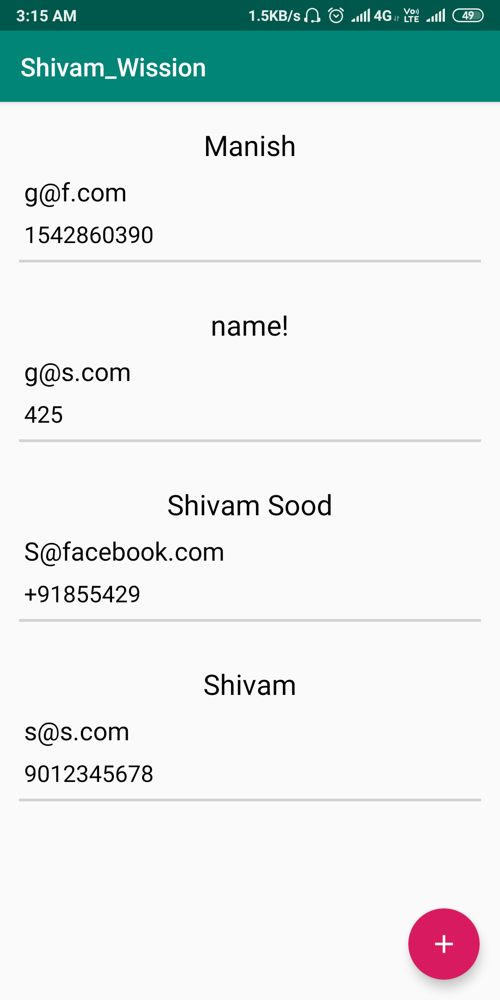
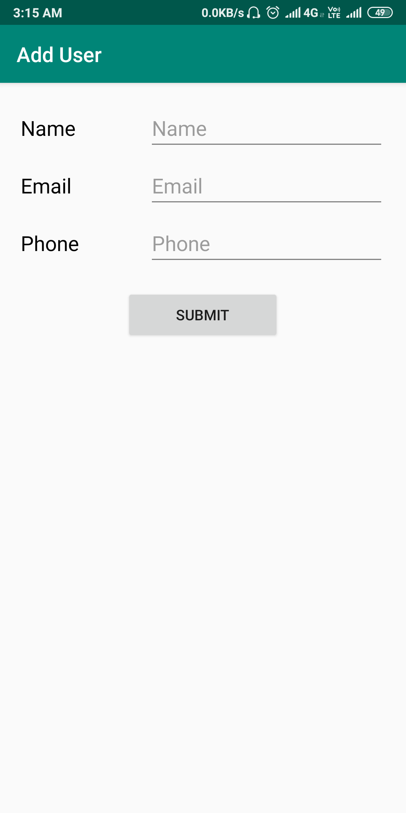
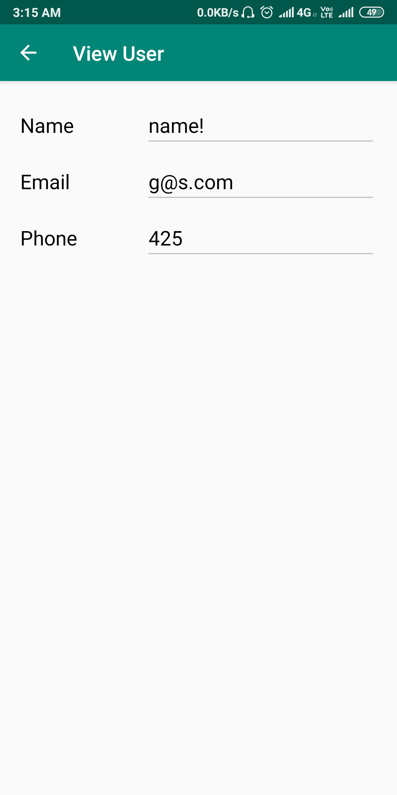

# MVVM_USER
This is an implementation of MVVM(Model View ViewModel) based architecture which is using firebase as the RESTful API and Retrofit as the client.

# Screenshots

#### This screen shows the collection of all the user stored in the database along with their information(Name, Email, Mobile) 

#### This screen shows the how to add new user to the database based on firebase

#### This screen shows the selected user in view only mode

